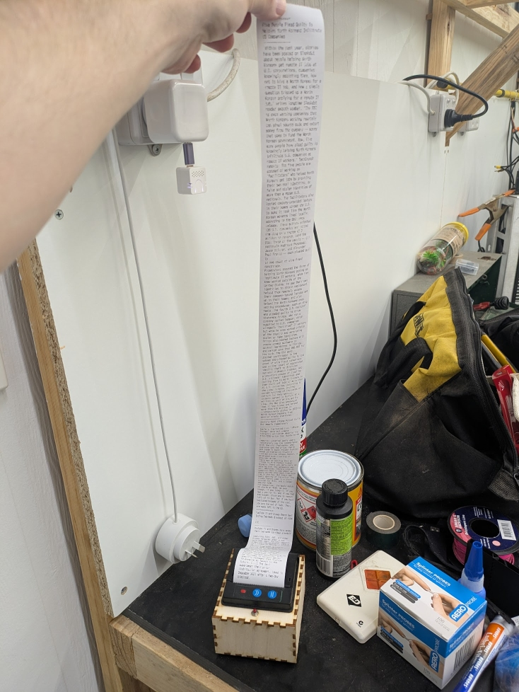

# stdoutflux

Connects to a [Miniflux](https://miniflux.app/) instance, pulls unread entries, formats them for printing on a limited-line display (32 characters by default) and outputs to stdout.

It's quite dumb. Much of it was written by copilot. I don't suggest you use it.

I (don't) use it like this:

    stdoutflux -markread | pv --rate-limit 64 | receipt

Where `pv` is [PipeViewer](https://www.ivarch.com/programs/pv.shtml) and `receipt` is a bash script that sends each line to my MQTT broker to be printed by a thermal receipt printer running esphome.

It does this:

You can set the Miniflux URL, API token, line length, and whether printed articles should be marked read (default false) with command-line arguments or environment variables. CLI args take precedence.

    MINIFLUX_URL
    MINIFLUX_API_TOKEN
    STDOUTFLUX_LINE_LENGTH
    STDOUTFLUX_MARK_READ

    $ stdoutflux -help
    Usage of stdoutflux:
        -linelength int
                Maximum line length for content wrapping (default 32)
        -markread
                Mark entries as read after printing (default false)
        -token string
                API token for Miniflux
        -url string
                Miniflux instance URL

Theoretically you could run this in a cronjob, or something.

## Installation

I'm not sure why you'd want to do this, but...

Download an install [Go](https://go.dev/doc/install). Add the `go/bin` directories to your `$PATH` as required. Then:

    go install github.com/tjhowse/stdoutflux

Optionally, to install PipeViewer:

    sudo apt update
    sudo apt install -y pv

## Known issues

My thermal printer doesn't use a monospaced font, so sometimes it wraps lines of its own accord, splitting words annoyingly. The default of 32 characters is the maximum characters that can fit on a line, if they're all narrow.